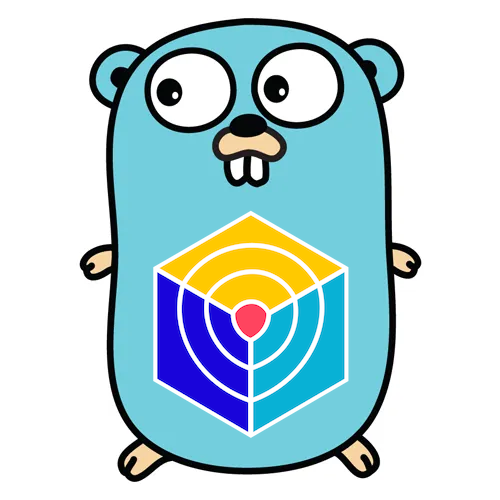

# GoTrivy

[![Build Status][build-status-svg]][build-status-url]
[![Go Report Card][goreport-svg]][goreport-url]
[![Docs][docs-godoc-svg]][docs-godoc-url]
[![License][license-svg]][license-url]

`gotrivy` is a Golang helper for [`github.com/aquasecurity/trivy`](https://github.com/aquasecurity/trivy).

 [build-status-svg]: https://github.com/grokify/gotrivy/workflows/test/badge.svg
 [build-status-url]: https://github.com/grokify/gotrivy/actions/workflows/test.yaml
 [goreport-svg]: https://goreportcard.com/badge/github.com/grokify/gotrivy
 [goreport-url]: https://goreportcard.com/report/github.com/grokify/gotrivy
 [docs-godoc-svg]: https://pkg.go.dev/badge/github.com/grokify/gotrivy
 [docs-godoc-url]: https://pkg.go.dev/github.com/grokify/gotrivy
 [license-svg]: https://img.shields.io/badge/license-MIT-blue.svg
 [license-url]: https://github.com/grokify/gotrivy/blob/master/LICENSE
