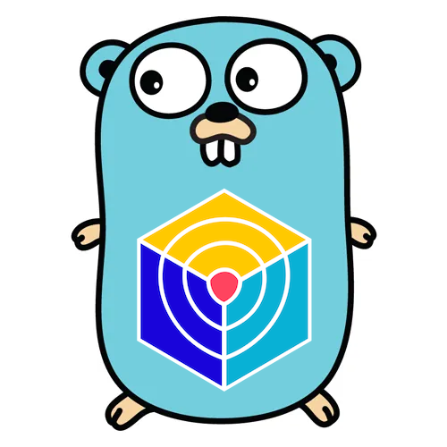

<div align="center">

# GoTrivy



[![Go CI][go-ci-svg]][go-ci-url]
[![Go Lint][go-lint-svg]][go-lint-url]
[![Go SAST][go-sast-svg]][go-sast-url]
[![Coverage][coverage-svg]][coverage-url]
[![Docs][docs-godoc-svg]][docs-godoc-url]
[![Docs][docs-mkdoc-svg]][docs-mkdoc-url]
[![Visualization][viz-svg]][viz-url]
[![License][license-svg]][license-url]

 [go-ci-svg]: https://github.com/grokify/gotrivy/actions/workflows/go-ci.yaml/badge.svg?branch=main
 [go-ci-url]: https://github.com/grokify/gotrivy/actions/workflows/go-ci.yaml
 [go-lint-svg]: https://github.com/grokify/gotrivy/actions/workflows/go-lint.yaml/badge.svg?branch=main
 [go-lint-url]: https://github.com/grokify/gotrivy/actions/workflows/go-lint.yaml
 [go-sast-svg]: https://github.com/grokify/gotrivy/actions/workflows/go-sast-codeql.yaml/badge.svg?branch=main
 [go-sast-url]: https://github.com/grokify/gotrivy/actions/workflows/go-sast-codeql.yaml
 [coverage-svg]: https://img.shields.io/badge/coverage-56.9%25-orange
 [coverage-url]: https://github.com/grokify/gotrivy
 [docs-godoc-svg]: https://pkg.go.dev/badge/github.com/grokify/gotrivy
 [docs-godoc-url]: https://pkg.go.dev/github.com/grokify/gotrivy
 [docs-mkdoc-svg]: https://img.shields.io/badge/Go-dev%20guide-blue.svg
 [docs-mkdoc-url]: https://grokify.github.io/gotrivy
 [viz-svg]: https://img.shields.io/badge/visualizaton-Go-blue.svg
 [viz-url]: https://mango-dune-07a8b7110.1.azurestaticapps.net/?repo=grokify%2Fgotrivy
 [loc-svg]: https://tokei.rs/b1/github/grokify/gotrivy
 [repo-url]: https://github.com/grokify/gotrivy
 [license-svg]: https://img.shields.io/badge/license-MIT-blue.svg
 [license-url]: https://github.com/grokify/gotrivy/blob/main/LICENSE

</div>

`gotrivy` is a Golang helper for [`github.com/aquasecurity/trivy`](https://github.com/aquasecurity/trivy) ([reference](https://pkg.go.dev/github.com/aquasecurity/trivy)).

The primary purpose of this library is currently to create XSLX reports from a JSON report file. [Trivy provides reports in Table and JSON formats, along with a custom Template capability](https://aquasecurity.github.io/trivy/v0.17.2/examples/report/). This libary provides an additional XLSX option via [`github.com/grokify/gocharts`](https://github.com/grokify/gocharts). This can be run from the CLI as [`cmd/gotrivy/main.go`](cmd/gotrivy/main.go) or it can be done programmatically by inspecting the code of that file.

[`gotrivy.Report`](https://pkg.go.dev/github.com/grokify/gotrivy#Report) is an extension of [`github.com/aquasecurity/trivy/pkg/types.Report`](https://pkg.go.dev/github.com/aquasecurity/trivy/pkg/types#Report).

## Installation

`go install github.com/grokify/gotrivy/cmd/gotrivy`

## Usage

`gotrivy -i <path-to-report.json> [-o path-to-report.xlsx]`

If an output file isn't provided, a default output filename and path is used setting the filename to the original filename with a `.xlsx` suffix in the current directory.

## References

### Scan Image

The following is an example of scanning a local image:

```
% docker image ls
REPOSITORY                       TAG       IMAGE ID       CREATED        SIZE
grokify/ringcentral-permahooks   v0.2.3    af80576e5e7d   6 months ago   640MB
% trivy image -f json grokify/ringcentral-permahooks > trivy-report.json
% gotrivy -i trivy-report.json -o trivy-report.xlsx
```

### Scan JAR

```
% trivy -d fs path/to/jar
% trivy -d fs path/to/pom.xml
```

Extract `pom.xml` from JAR file:

```
% unzip myfile.jar pom.xml
```

```
% trivy -d fs pom.xml 
2024-10-30T01:26:21.429-0700	DEBUG	Severities: ["UNKNOWN" "LOW" "MEDIUM" "HIGH" "CRITICAL"]
2024-10-30T01:26:21.429-0700	DEBUG	Ignore statuses	{"statuses": null}
2024-10-30T01:26:21.440-0700	DEBUG	cache dir:  /path/to/Caches/trivy
2024-10-30T01:26:21.440-0700	DEBUG	DB update was skipped because the local DB is the latest
2024-10-30T01:26:21.440-0700	DEBUG	DB Schema: 2, UpdatedAt: 2024-10-30 06:47:03.247108911 +0000 UTC, NextUpdate: 2024-10-31 06:47:03.24710874 +0000 UTC, DownloadedAt: 2024-10-30 07:37:27.722974 +0000 UTC
2024-10-30T01:26:21.440-0700	INFO	Vulnerability scanning is enabled
2024-10-30T01:26:21.440-0700	DEBUG	Vulnerability type:  [os library]
2024-10-30T01:26:21.440-0700	INFO	Secret scanning is enabled
2024-10-30T01:26:21.440-0700	INFO	If your scanning is slow, please try '--scanners vuln' to disable secret scanning
2024-10-30T01:26:21.440-0700	INFO	Please see also https://aquasecurity.github.io/trivy/v0.46/docs/scanner/secret/#recommendation for faster secret detection
2024-10-30T01:26:21.441-0700	DEBUG	No secret config detected: trivy-secret.yaml
2024-10-30T01:26:21.441-0700	DEBUG	The nuget packages directory couldn't be found. License search disabled
2024-10-30T01:26:21.441-0700	DEBUG	Walk the file tree rooted at 'pom.xml' in parallel
2024-10-30T01:26:21.441-0700	DEBUG	Resolving org.json:json:20220924...
2024-10-30T01:26:21.625-0700	DEBUG	Start parent: org.sonatype.oss:oss-parent:9
2024-10-30T01:26:21.626-0700	DEBUG	Exit parent: org.sonatype.oss:oss-parent:9
2024-10-30T01:26:21.638-0700	DEBUG	OS is not detected.
2024-10-30T01:26:21.638-0700	DEBUG	Detected OS: unknown
2024-10-30T01:26:21.638-0700	INFO	Number of language-specific files: 1
2024-10-30T01:26:21.638-0700	INFO	Detecting pom vulnerabilities...
2024-10-30T01:26:21.638-0700	DEBUG	Detecting library vulnerabilities, type: pom, path: pom.xml

pom.xml (pom)

Total: 2 (UNKNOWN: 0, LOW: 0, MEDIUM: 0, HIGH: 2, CRITICAL: 0)

┌───────────────┬────────────────┬──────────┬────────┬───────────────────┬───────────────┬────────────────────────────────────────────┐
│    Library    │ Vulnerability  │ Severity │ Status │ Installed Version │ Fixed Version │                   Title                    │
├───────────────┼────────────────┼──────────┼────────┼───────────────────┼───────────────┼────────────────────────────────────────────┤
│ org.json:json │ CVE-2022-45688 │ HIGH     │ fixed  │ 20220924          │ 20230227      │ json stack overflow vulnerability          │
│               │                │          │        │                   │               │ https://avd.aquasec.com/nvd/cve-2022-45688 │
│               ├────────────────┤          │        │                   ├───────────────┼────────────────────────────────────────────┤
│               │ CVE-2023-5072  │          │        │                   │ 20231013      │ JSON-java: parser confusion leads to OOM   │
│               │                │          │        │                   │               │ https://avd.aquasec.com/nvd/cve-2023-5072  │
└───────────────┴────────────────┴──────────┴────────┴───────────────────┴───────────────┴────────────────────────────────────────────┘
```

## Update Trivy Databases

```
% trivy image --download-db-only
% trivy image --download-java-db-only
% trivy image --reset
```

## WebGoat Example

```
% trivy fs target/webgoat-2025.4-SNAPSHOT.jar --skip-files ".*\.class,.*META-INF.*"
```
